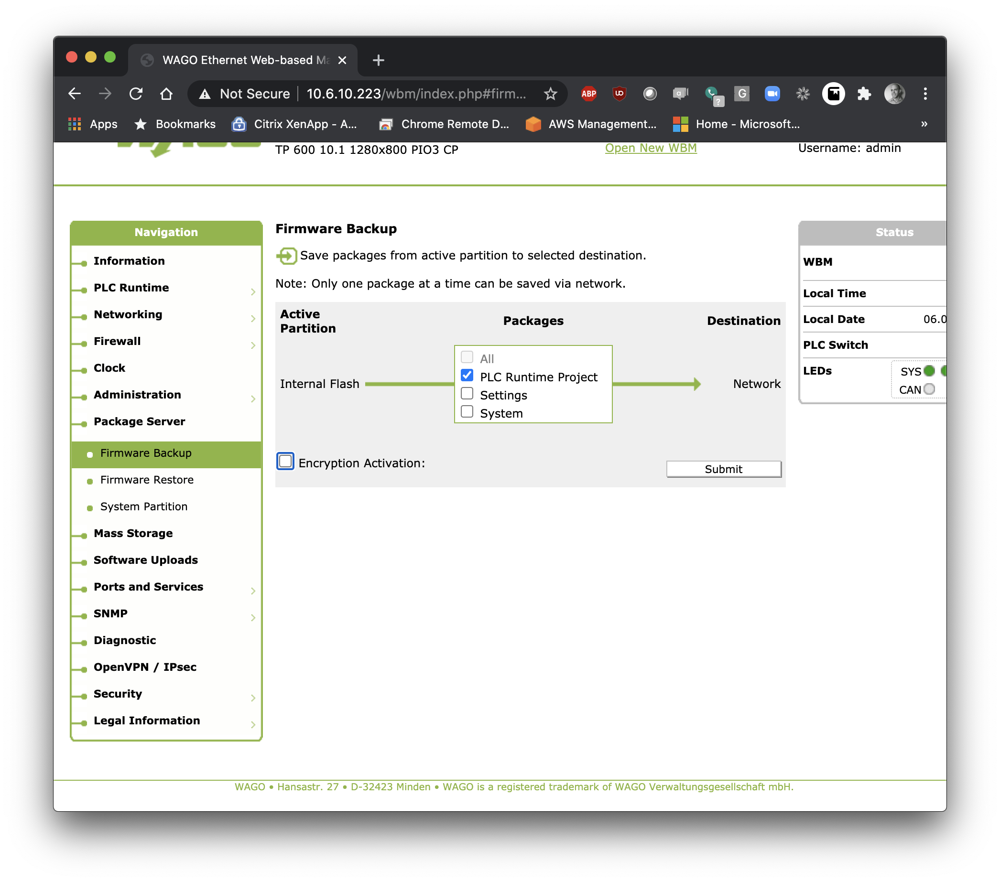

# eruntime-project-updater
Python tool for auto-updating a WAGO controller's e!RUNTIME files based on GitHub releases.  This requires WAGO firmware version 16 and higher or install of the cURL service .ipk.  

You can install this tool using the install.sh script included.  Open a shell session with your controller and paste the following:
    
    wget https://raw.githubusercontent.com/jessejamescox/eruntime-project-updater/master/src/bash/install.sh && chmod +x install.sh

Execute this script with:
    
    ./install.sh

The install script will load the required python and config script and will also add a crontab, you will need to update your config file to look for the proper GitHub account and repository (next update will add secure repository login capabilities):

Now this script will run automatically, update the .tgz files created in the Web Based Management >> Package Server >> Firmware Backup.  

